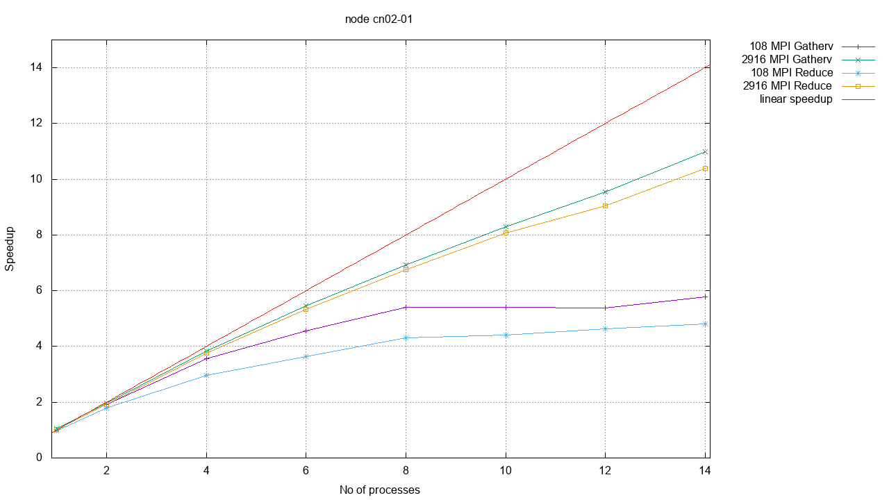

# Report on parallel efficiency

### MPI

Two different versions of the code were implemented and tested. The fist one considers a smaller buffer for each process where to store the forces; then it collects the data via a MPI_Gatherv. The second version is the one presented in the slides. Each process can compute partial forces for each atom. The results are collecte via a MPI_Reduce.

As presented in the following graph the second version is faster while the firs is slightly more efficient from the point of view of the memory usage.

### OpenMP

Following the instructions provided in the slides, two naive implementations of the algorithm using OpenMP were tested. The main problem using this interface is to avoid race conditions in the shared memory, in particular when computing the partial force on a atom. In the first implementation this is guaranteed via atomic updates while in the second Newton's third law is not taken in account.

### MPI + OpenMP

WIP
