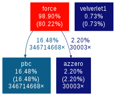
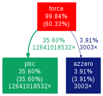
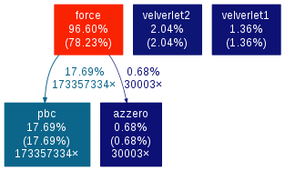
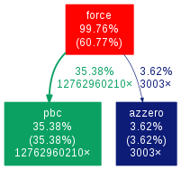
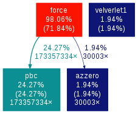
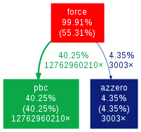
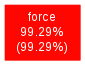

Optimization 
============

First optimization
------------------


In the fist optimization we take advantage of physics, and in particular of Newton's third law.
In particular, in the inner loop of the force computation we change j=0 with j=1+1 in order to avoid counting twice each i <--> j interaction .

```
...

for(i=0; i < (sys->natoms); ++i) {
        for(j=i+1; j < (sys->natoms); ++j) { 

...

```
This modifications has consequences on the calculation of the potential energy. In fact each couple now is counted only ones.
Therefore we removed the 0.5 multiplication in the following line.

```
sys->epot += 4.0*sys->epsilon*(pow(sys->sigma/r,12.0) -pow(sys->sigma/r,6.0)); 

```
And added the fx[j],fy[j] and fz[j] in the following lines:

```
                sys->fx[i] += rx/r*ffac; sys->fx[j] -= rx/r*ffac;  
                sys->fy[i] += ry/r*ffac; sys->fy[j] -= ry/r*ffac;  
                sys->fz[i] += rz/r*ffac; sys->fz[j] -= rz/r*ffac;

```  

This means that the force component of the particle i, f[i], because of the interaction with j, is equal in amplitute but opposite in sign to f[j], which is the force on j due to i.


The program was compiled with CFLAGS -Wall -g -O3 -ffast-math -fomit-frame-pointer -std=c11.

Profiling serial code with gprof without optimization - 108 particles



Profiling serial code with gprof without optimization - 2916 particles



Profiling serial code with gprof with the first optimization - 108 particles



Profiling serial code with gprof with the first optimization - 2916 particles




Second optimization
-------------------


In the second optimization we take advantage of mathematics and in particular we avoid expensive operations such as power and square root.
The main idea is to always avoid the use of r, but use instead r^2 as building block of the formulas, since r^2 needs to be calculated anyway.
The first apperance of r is in the distance check. Here we avoid the use of r by observing that if r>Rcut then also r^2 > Rcut^2.
The second appearance of r is in the calculation of forces. Here the idea is to never use r in the ffac definition.
We observe that a division by r appears in ffac, and then ffac is divided again by r, when fx,fy and fz are computed. So we simply redefine ffac in order to divide by r^2 once, instead of using two consecutive division by r.

The last improvement consists in never using pow() to calculate (sigma/r)^12 and (sigma/r)^6.
First of all we define the new variable sigma2=sys->sigma*sys->sigma.
The r2=rx*rx + ry*ry + rz*rz is redefined as r2 = sigma2/r2.
In this way, we define r6 = r2*r2*r2, and r12 = r6*r6, so that only multiplications are used.

At the end the force component is defined as ffac 

```
ffac = -4.0*sys->epsilon*(-12.0*r12+6*r6)*r2/sigma2

``` 
instead of 

```
-4.0*sys->epsilon*(-12.0*pow(sys->sigma/r,12.0)/r+6*pow(sys->sigma/r,6.0)/r)) 

```

and epot 

```
sys->epot += 4.0*sys->epsilon*(r12-r6)

```
instead of 

```
0.5*4.0*sys->epsilon*(pow(sys->sigma/r,12.0 -pow(sys->sigma/r,6.0)).

```

Profiling serial code with gprof with the first + the second optimization - 108 particles



Profiling serial code with gprof with the first + the second optimization - 2916 particles




Implement cell list for better scaling with system size
--------------------------------------------------------

In order to implement the cell list we divided the simulation box into small cells of equal size.
So that each particle in a cell interacts only with the other particles in the same cell and its 26 neighbor cells. 
The particles belonging to a cell are defined using linked lists. 
This allows us to achieve am O(N) scaling instead of an O(N square) scaling.

### Cells ###

The main idea here is to divide the box in cells, so that the distance i<->j is checked only if i and j belong to neighbouring cells.
The edge lengths of each cell should be larger than radius.
This requirement limits the maximum number of cells in which the box can be divided.


rcut = radius
lc = number of cells per dimension   --> lc = box/rcut
ncells= tot numb of cells to the power of three   --> ncells = lc*lc*lc
rc= side of the cell   --> rc = box/lc

First we calculate how many cells (per side), lc, can be used, by simply dividing box/rcut (integer division).
Then we calculate the side of the cell by rc = box/lc.

With the flag yescell we limit the execution of the cell_list code to systems with box size larger than 3*rcut, or equivalently, if at least 27 cells can be obtained within the box (if ncell > 27 => yescell =1 else yescell => 0). This condition is verified when our input is 2069 but not when our input is 108, given the rcut of the potential. The 108 particle system is too small to benefit from the cell list therefore we execute the previous version of the code on it.

```
 sys.yescell = 1; //2069/
    if(sys.ncells < 27) sys.yescell = 0; //108/
```

The main modification of the code is in the force(...) function. But we also define additional struct variables (ncell, lc, rc, ...) and two additional utility functions signR and and Putinthebox, to enforce the fact that particles always stay in the simulation cell, i.e. their coordinate a always defined in the range (0...box).

```
    if(sys->yescell) Putinthebox(sys);

...

void Putinthebox(mdsys_t *sys) {         
    int i;                                
    for (i=0; i<(sys->natoms); i++) {  
    sys->rx[i] = sys->rx[i] - SignR(0.5*sys->box,sys->rx[i]) - SignR(0.5*sys->box,sys->rx[i]-sys->box);  
    sys->ry[i] = sys->ry[i] - SignR(0.5*sys->box,sys->ry[i]) - SignR(0.5*sys->box,sys->ry[i]-sys->box);  
    sys->rz[i] = sys->rz[i] - SignR(0.5*sys->box,sys->rz[i]) - SignR(0.5*sys->box,sys->rz[i]-sys->box);    
    }
}      

```

### Linked list ###


Suppose we have Ncell cells > 27.

The additional data structure are two arrays:


head array: contains the index of a particle in the c-th cell. If the cell is empty head[c]=E (EMPTY).

lscl array: contains the particle index.

Particles j which belong to cell c, are accessed in this way:
1. we first find index of the particle in the head  j=head[ c ];
2. then we jump from elements in the list lscl as follow

```

j <- lslc[ j ];
until lscl[ j ] = E

```

so that, the position i nth list lcsl of the next particle is the current value "j" accessed.
This data structure only need Ncell + N elements in memory. The implementation in which each cell has a list of particles belonging to would require instead the allocation of a Ncell x N matrix, since in the worst case, all the N particles can be in a single cell.


using this data structure, at the beginnig of the force function we initialize the head and the list, i.e. we assign the particles to each cell.
This is done simply by dividing each coordinate of the particle i (rx,ry,rz) by rc, and taking the integer part.


```
        mc[0] = sys->rx[i]/sys->rc;
        mc[1] = sys->ry[i]/sys->rc;
        mc[2] = sys->rz[i]/sys->rc;
```

        
mc[a], a=0,1,2 are the integer coordinate of the cell c.
The cell index c is then obtained by the formula:


```
c = mc[0]*lcyz + mc[1]*sys->lc + mc[2];   (with lcyz=sys->lc*sys->lc )

```

Once we build these array the force loops begin.
Now, instead of looping on all particles i, and j, we loop on the cells.

The outer loop is:


```
for (mc[0]=0; mc[0]<sys->lc; (mc[0])++)
 for (mc[1]=0; mc[1]<sys->lc; (mc[1])++)
 for (mc[2]=0; mc[2]<sys->lc; (mc[2])++) {

c = mc[0]*lcyz+mc[1]*sys->lc+mc[2];

```

so that here we consider the "current cell" c.


Then the inner loop:


```
               for (mc1[0]=mc[0]-1; mc1[0]<=mc[0]+1; (mc1[0])++)
                for (mc1[1]=mc[1]-1; mc1[1]<=mc[1]+1; (mc1[1])++)
                for (mc1[2]=mc[2]-1; mc1[2]<=mc[2]+1; (mc1[2])++) {
                
                 c1 = ((mc1[0]+sys->lc)%sys->lc)*lcyz+((mc1[1]+sys->lc)%sys->lc)*sys->lc+((mc1[2]+sys->lc)%sys->lc);
```
        
scans the "nearest neghoubour" of c, c1.

For example, if the current cell "c" is defined by integer cordinate mc = [2 ; 3 ;1], the neighbouring cells "c1" are given by indexes in the range
mc1 = [ (1,2,3)  ; (2,3,4)  ;  (0,1,2) ]  for a total of 3x3x3 = 27 combinations of mc1's.

Suppose now that we are considering cell "c" and "c1", we need to probe all possible pairs  i<->j of particles, with i belogning to "c", and j belonging to "c1".
This is done by starting from the head [c] and then jumping through elements of lscl, as defined above, until we find the EMPTY (E) elements.

An important limit case arises when the calculated nearest neighbour cell "c1" falls outside the limit of the box, i.e. when mc[a] = 0, for some a=0,1,2, and mc1= mc[a]-1, or when mc[a]=lc, and mc1 = mc[a]+1.
In this case, we use an additional vector rshift[a], and when the nearest neighbour cell c1, is outside the box, along the direction a, we define rshift to be +L (or -L) as follows.


```

   for (a=0; a<3; a++) {
                               if (mc1[a] < 0)
                                rshift[a] = -sys->box;
                               else if (mc1[a]>=sys->lc)
                                rshift[a] = sys->box;
                               else
                                rshift[a] = 0.0;
                            }

```
                            
Then we add this shift when calculating the actual distance between i and j.
Indeed the formula for calculating "c1" from the integer coordinates mc1[a], a=0,1,2,
c1 = ((mc1[0]+sys->lc)%sys->lc)*lcyz+((mc1[1]+sys->lc)%sys->lc)*sys->lc+((mc1[2]+sys->lc)%sys->lc);
automatically takes care of periodic boundary condition for the index of the cell (i.e c1 is always within 0 and ncell, but the postion of the particles need to be shifted by +/-L to calculate the correct periodic image distance.

Suppose we have 9 cell in 2 dimension, labeled as follows

|6 7 8
|3 4 5
|0 1 2

The left neighbour of cell c=3, is c1=5, so while calculating the pair i<->j, the particles "j", belong to 5, but their coordinates in this case need to be shifted by -L.


```

                rx=sys->rx[i] - ( sys->rx[j]+rshift[0]);
            ry=sys->ry[i] - ( sys->ry[j]+rshift[1]);
        rz=sys->rz[i] - ( sys->rz[j]+rshift[2]);

```

Profiling serial code with gprof with the first + the second optimization + cell list - 2916 particles




